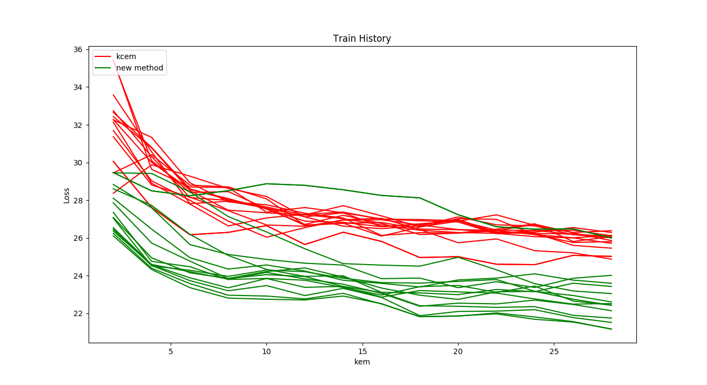
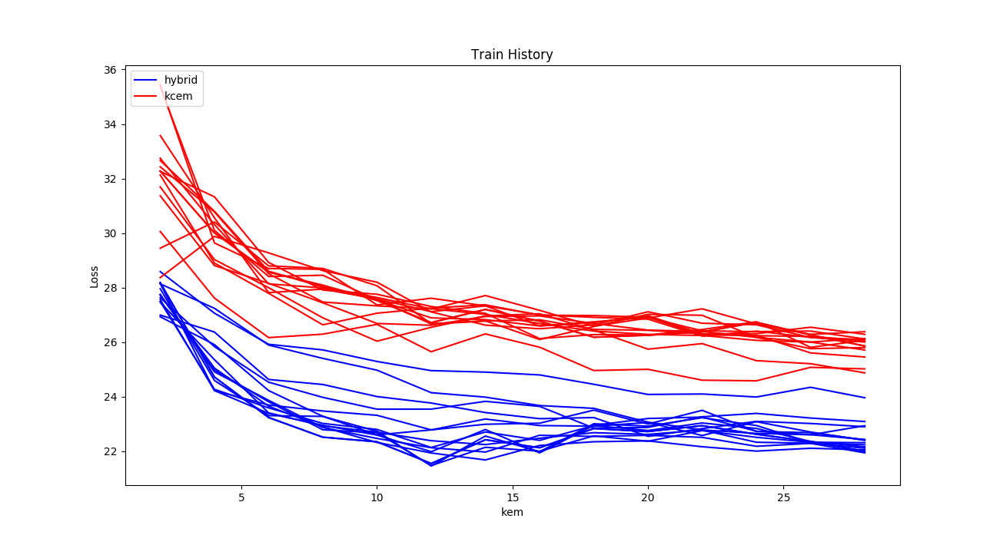
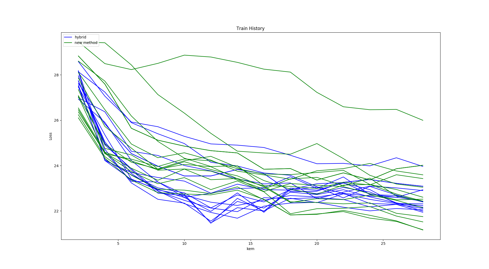
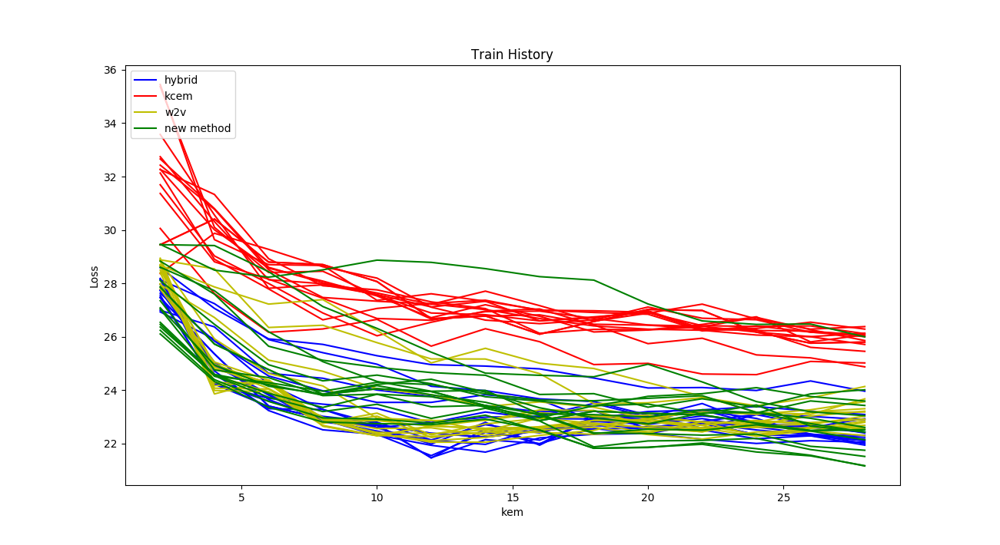
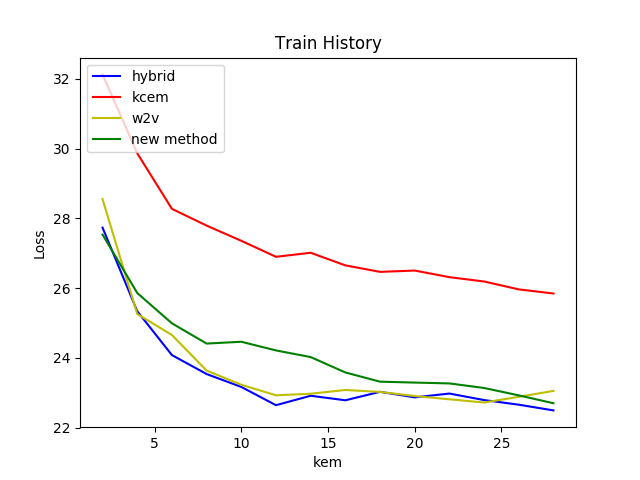

# kcem

KCEM的class檔，可以透過 `pip` 直接安裝

## Getting Started

These instructions will get you a copy of the project up and running on your local machine for development and testing purposes. See deployment for notes on how to deploy the project on a live system.

## Prerequisities

1. OS：Ubuntu / OSX would be nice
2. environment：need `python3`

  - Linux：`sudo apt-get update; sudo apt-get install; python3 python3-dev`
  - OSX：`brew install python3`

## Installing

1. `pip install kcem`

## Running & Testing

## Run

1. `settings.py`裏面需要新增`kcem`這個app：

  - add this:

    ```
    INSTALLED_APPS=[
    ...
    ...
    ...
    'kcem',
    ]
    ```

2. `urls.py`需要新增下列代碼 把所有search開頭的request都導向到`kcem`這個app：

  - add this:

    ```
    import kcem.urls
    urlpatterns += [
        url(r'^kcem/', include(kcem.urls))
    ]
    ```

3. `python manage.py runserver`：即可進入頁面 `127.0.0.1:8000/kcem` 測試 `kcem` 是否安裝成功。

### Break down into end to end tests

目前還沒寫測試...

### And coding style tests

目前沒有coding style tests...

## Deployment

`kcem` is a django-app, so depends on django project.

`kcem` 是一般的django插件，所以必須依存於django專案

## Built With

- simplejson
- djangoApiDec,
- pymongo,

## Contributors

- **張泰瑋** [david](https://github.com/david30907d)

## License

This package use `GPL3.0` License.

# KCEM experiments

kcem有兩個參數，kcm取幾個、kem取幾個，本實驗使用[google的知識圖譜](https://github.com/UDICatNCHU/Open-Sentiment-Training-Data/blob/master/Ontology_from_google.json)約500筆做測試

為了畫成二維的圖，把kcm的參數表示成顏色、loss為y軸、kem數量為x軸

參數的範圍從2~30 `range(2, 30, 2)`


1. 舊的kcem跟取第一段維基百科去斷詞，而且不是紀錄頻率而是用set儲存所做出來的kcem效果的比較
* kh:kcem hybrid
* kn:kcem new method

2. hybrid的loss V.S. kcem的loss:
* 數字：代表kcm的參數，用不同顏色表示

3. hybrid 的loss V.S. new method的loss:
* 數字：代表kcm的參數，用不同顏色表示

4. 四種版本的kcem比較:
同一種方法但是不同kcm、kem參數的loss都畫成同一顏色的線

5. 四種全部都取平均:
同一種方法但是不同kcm、kem參數的loss都取平均,畫成同一顏色的線


### 10/13小結論：

`new method`因為只取第1段的表現比較不穩定，所以採用hybrid方法

new method相關的實驗程 式放在[new_kcem_method](new_kcem_method)

將用hybrid的min：`kcm:22 kem:12 loss:21.458033917027294` 這組參數當作目前最佳的`is-a`去做後續應用